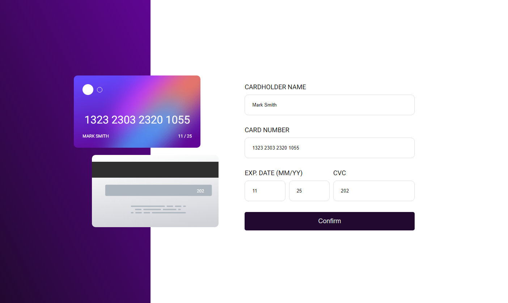

## Overview
This was a challenge created by www.frontendmentor.io where you're given the design of a website and have to code it up from scratch.

The only information you are given is a screenshot of the mobile and web version of the page, and a description of the functionality.

## The challenge

Your challenge is to build out this interactive card details form and get it looking as close to the design as possible.

You can use any tools you like to help you complete the challenge. So if you've got something you'd like to practice, feel free to give it a go.

Your users should be able to: 

- Fill in the form and see the card details update in real-time
- Receive error messages when the form is submitted if:
  - Any input field is empty
  - The card number, expiry date, or CVC fields are in the wrong format
- View the optimal layout depending on their device's screen size
- See hover, active, and focus states for interactive elements on the page

Want some support on the challenge? [Join our Slack community](https://www.frontendmentor.io/slack) and ask questions in the **#help** channel.

### Expected behaviour

- Update the details on the card as the user fills in the fields
- Validate the form fields when the form is submitted
- If there are no errors, display the completed state
- Reset the form when the user clicks "Continue" on the completed state

## Built With
html
css
flex
scss

### Final web version screenshot: 

### Final mobile version screenshot: 

  

## Links
Solution URL: Will be updated soon~

## Continued Development: 
- Add error messages when submitting form with invalid inputs
- Do not allow user to add specific inputs like letters in the credit card number input

